## Dijkstras最短路径算法的MPI和CUDA实现

> 主要内容

* dijkstra串行算法
* 算法并行性分析
* MPI的dijkstra实现
* CUDA的dijkstra实现
* 并行效率分析

<!--more-->

### dijkstra串行算法

*串行算法核心思想*

引入一个辅助向量D，它的每个分量D[i]为源顶点v到其他顶点v[i]的路径长度。初始态为：如有从v到vi的路径，则D[i]为弧[v,vi]的权值；否则D[i]为无穷大。显然D[j] = min{D[i]}为顶点v出发到其他顶点的一条最短路径的长度，其路径为（v，vj）。下一条最短路径长度要么是源顶点v直接到某一顶点vk的长度，即{v，vk}。要么是源顶点v经过顶点vj到某一顶点的长度，即{v，vj，vk}。假设S为已经求得最短路径的顶点的集合，下一条最短路径（设其终点为x），要么是弧{v， vx}，要么为中间只经过S中顶点而最后到达终点X的路径。
在一般情况下，下一条最短路径的长度为：D[j] = min{D[i] | vi 属于 V-S} 其中V为图顶点的集合， D[i]为弧{v， vi}的权值，或者为D[k]和弧{vk， vi}权值之和。

*串行算法描述*
输入：图G的邻接矩阵m[0...n-1][0...n-1]，源顶点 v
输出：最短路径值向量D[0...n-1], 最短路径矩阵p[0...n-1][0...n-2].其中D[i]为源顶点v到顶点vi的最短路径长度，向量p[i]为源顶点v到顶点vi的最短路径
1）初始化D[i]
     D[i] = m[v][vi] == 无穷大 ? 无穷大 : m[v][vi]
2)计算当前最短路径值
     min = min{D[i]}
     final[i] = 1   //标记顶点i已经取得最短路径
3）更新最短路径值及最短路径
```
     for(i = 0; i < n; i++)
         if(!final[i])
             if(D[i] > min + m[vk][vi])
                 D[i] = min + m[vk][vi];
             end if
          endif
         for( j = 0; j < n-1 ; j++)
               if(p[vk][j] != 无穷大)
                   p[vi][j] = p[vk][j];
              end if
         end for
         p[vi][j] = vi
     end for
```
4) 输出最短路径和最短路径值

### 算法并行性分析

对这个算法进行并行化分析，显然初始化向量D，更新最短路径值是可以并行化实现的，因为只要有了当前最短路径和最短路径值，各个顶点的最短路径的算法是相互独立的。也就是说虽然第一层循环是有依赖关系不可以并行化，但是内层循环是相互独立的。所以在并行化算法中，如何求得当前的最短路径和最短路径值成为关键。

假设一共用P个进程，让每个进程负责n/p个顶点，每个进程都有自己的向量D和最短路径p。首先，可以计算出各个进程的当前最短路径，并将局部最短路径发往进程0，进程0对这些进程的最短路径进行规约，取得当前的全局最短路径，并将这一结果广播到所有的进程。

对于CUDA程序来说，我设想每个block就对应MPI中的一个进程。

1. 设置共享内存thread_local_min来存放每个线程计算出来的最小值，每个block中一个线程处理几个顶点，用`  int element_per_thread = (int)ceil(N*1.0 / (blockDim.x*gridDim.x));` 来计算每个线程要处理的顶点的个数。每个线程获取自己对应的节点到源点的距离，存到thread_local_min中。然后进行一个同步操作syncthreads();每个block中blockIdx.x=0的线程负责从thread_local_min中计算整个block中的局部最小，存到d_local_min。
2. 再由这些局部最小计算一个global_min。
3. 最后在每个线程中重新计算每个顶点与全局最小的new_dist，`new_dist = d_all_dist[u] + mat[u*N + global_index]`,并进行更新。

### MPI的dijkstra实现

变量定义
```
    int loc_N; // I need a local copy for N
    int loc_n; //how many vertices I need to process.
    int *loc_mat; //local matrix
    int *loc_dist; //local distance
    int *loc_pred; //local predecessor
    bool *loc_visit; //local visit record array
    int *displs; // Integer array (of length group size) containing the number of elements 
    // that are received from each process (significant only at root).
    // 整型数组(长度为组的大小), 其值为从每个进程接收的数据个数(仅对于根进程)


    int *rcounts; //Integer array (of length group size). Entry i specifies the displacement 
    // relative to recvbuf at which to place the incoming data from process i
    // 整数数组,每个入口i表示相对于recvbuf的位移,此位移处存放着从进程i中接收的输入数据(仅对于根进程)
```

**step 1: broadcast N**：广播N
**step 2: find loc_n**：总节点个数除以进程数,得到平均每个处理器要处理的节点个数
**step 3: allocate local memory**：分配局部内存
**step 4: broadcast matrix mat**：广播邻接矩阵权重
**step 5: dijkstra algorithm**:循环N次，每次找出一个全局最小

```
#include "stdafx.h"
#include <stdio.h> 
#include <mpi.h>
#include <time.h>
#include<iostream>
using namespace std;
#include <string>
#include <cassert>
#include <fstream>
#include <vector>
#include <climits>
#include <cstring>
#include <algorithm>
//#include "mpi.h"

using std::string;
using std::cout;
using std::endl;
using std::vector;

//#define DE_BUG

/*
* utils is a namespace for utility functions
* including I/O (read input file and print results) and one matrix dimension convert(2D->1D) function
*/
namespace utils {
    int N; //number of vertices
    int *mat; // the adjacency matrix

    /*
    * convert 2-dimension coordinate to 1-dimension
    */
    int convert_dimension_2D_1D(int x, int y) {
        return x * N + y;
    }

    int read_file(string filename) {
        std::ifstream inputf(filename, std::ifstream::in);
        inputf >> N;
        assert(N < (1024 * 1024 *
            20)); // input matrix should be smaller than 20MB * 20MB (400MB, we don't have two much memory for multi-processors)
        mat = (int *)malloc(N * N * sizeof(int));
        for (int i = 0; i < N; i++)
        for (int j = 0; j < N; j++) {
            inputf >> mat[convert_dimension_2D_1D(i, j)];
        }

        return 0;
    }

    string format_path(int i, int *pred) {
        string out("");
        int current_vertex = i;
        while (current_vertex != 0) {
            string s = std::to_string(current_vertex);
            std::reverse(s.begin(), s.end());
            out = out + s + ">-";
            current_vertex = pred[current_vertex];
        }
        out = out + std::to_string(0);
        std::reverse(out.begin(), out.end());
        return out;
    }

    int print_result(int *dist, int *pred) {
        std::ofstream outputf("output.txt", std::ofstream::out);
        outputf << dist[0];
        for (int i = 1; i < N; i++) {
            outputf << " " << dist[i];
        }
        for (int i = 0; i < N; i++) {
            outputf << "\n";
            if (dist[i] >= 1000000) {
                outputf << "NO PATH";
            }
            else {
                outputf << format_path(i, pred);
            }
        }
        outputf << endl;
        return 0;
    }
}//namespace utils
// you may add some helper functions here.

//找每个子图中距离最小的一个
int find_local_minimum(int *dist, bool *visit, int loc_n) {
    int min = INT_MAX;
    int u = -1;
    for (int i = 0; i < loc_n; i++) {
        if (!visit[i]) {
            if (dist[i] < min) {
                min = dist[i];
                u = i;
            }
        }
    }
    return u;
}


void dijkstra(int my_rank, int N, int p, MPI_Comm comm, int *mat, int *all_dist, int *all_pred)
{

    //------your code starts from here------
    int loc_N; // I need a local copy for N
    int loc_n; //how many vertices I need to process.
    int *loc_mat; //local matrix
    int *loc_dist; //local distance
    int *loc_pred; //local predecessor
    bool *loc_visit; //local visit record array

    int *displs; // Integer array (of length group size) containing the number of elements 
    // that are received from each process (significant only at root).
    // 整型数组(长度为组的大小), 其值为从每个进程接收的数据个数(仅对于根进程)


    int *rcounts; //Integer array (of length group size). Entry i specifies the displacement 
    // relative to recvbuf at which to place the incoming data from process i
    // 整数数组,每个入口i表示相对于recvbuf的位移,此位移处存放着从进程i中接收的输入数据(仅对于根进程)
    // step 1: broadcast N
    if (my_rank == 0) {
        loc_N = N;
    }
    //MPI_Bcast(address,count,datatype,root,comm)
    MPI_Bcast(&loc_N, 1, MPI_INT, 0, comm);

    //step 2: find loc_n,总节点个数除以进程数,得到平均每个处理器要处理的节点个数
    loc_n = loc_N / p;
    //最后一个进程可能分配的节点个数要少一些
    if (my_rank == p - 1) {
        loc_n = loc_N - (p - 1) * loc_n;
    }

    //#ifdef DE_BUG
    //  std::cout << "MPI process: " << my_rank << "  loc_n: " << loc_n << std::endl;
    //#endif

    //step 3: allocate local memory,分配局部内存
    loc_mat = (int *)malloc(sizeof(int)* loc_N *loc_N);
    loc_dist = (int *)malloc(sizeof(int)* loc_n);
    loc_pred = (int *)malloc(sizeof(int)* loc_n);
    loc_visit = (bool *)malloc(loc_n * sizeof(bool));

    displs = (int *)calloc(p, sizeof(int));
    rcounts = (int *)calloc(p, sizeof (int));

    int index = 0;
    for (int i = 0; i < p; ++i) {
        if (i != p - 1) {
            rcounts[i] = loc_N / p;
            displs[i] = index;
        }
        else {
            rcounts[i] = loc_N - loc_N / p * i;
            displs[i] = index;
        }
        index += rcounts[i];
    }
    std::cout << "MPI process: " << my_rank << " rcounts[0]" << rcounts[0] <<" displs[0]" <<rcounts[1] << std::endl;
    //step 4: broadcast matrix mat
    if (my_rank == 0) {
        memcpy(loc_mat, mat, loc_N * loc_N * sizeof (int));
    }
    MPI_Bcast(loc_mat, loc_N * loc_N, MPI_INT, 0, comm);

    //step 4: dijkstra algorithm
    // initial loc_dist, loc_pred, loc_vist
    //找出与source节点相连的所有节点，将其访问状态置为false
    //loc_dist中保存的是当前处理器需要处理的所有节点的与source的距离
    //loc_pred中保存了当前处理节点的上一个节点
    //loc_visit中保存了当前节点是否确定了最短距离
    for (int loc_i = 0; loc_i < loc_n; loc_i++) {
        int u = my_rank * (loc_N / p) + loc_i;
        loc_dist[loc_i] = loc_mat[utils::convert_dimension_2D_1D(0, u)];
        loc_pred[loc_i] = 0;
        loc_visit[loc_i] = false;
    }

    //将source节点的访问状态置为true
    if (my_rank == 0) {
        loc_visit[0] = true;
    }

    for (int i = 1; i < loc_N; i++) {
        // find the global minimum
        int loc_u = find_local_minimum(loc_dist, loc_visit, loc_n);//找局部最小值
        int loc_min[2], glo_min[2];
        if (loc_u == -1){
            loc_min[0] = INT_MAX;
            loc_min[1] = my_rank * (loc_N / p) + loc_u;
        }
        else{
            loc_min[0] = loc_dist[loc_u];
            loc_min[1] = my_rank * (loc_N / p) + loc_u;
        }
        if (i == 1){
            std::cout << "MPI process: " << my_rank << " [0]" << loc_min[0] <<"[1]" << loc_min[1] << std::endl;
        }
        // 找全局最小值
        MPI_Allreduce(loc_min, glo_min, 1, MPI_2INT, MPI_MINLOC, comm);
        //找出全局最小值所在的线程，将其访问状态置为true
        int visit_pro = glo_min[1] / (loc_N / p);
        if (visit_pro == p){
            visit_pro = p - 1;
        }

        if (my_rank == visit_pro) {
            int u = glo_min[1] - visit_pro * (loc_N / p);
            loc_visit[u] = true;
        }
        //遍历其他节点，更新距离值
        for (int v = 0; v < loc_n; v++) {

            if (!loc_visit[v]) {
                int new_dist = glo_min[0] + loc_mat[utils::convert_dimension_2D_1D(glo_min[1], my_rank * (loc_N / p) + v)];
                if (new_dist < loc_dist[v]) {
                    loc_dist[v] = new_dist;
                    loc_pred[v] = glo_min[1];
                }
            }
        }
    }

    //step 5: retrieve results back
    //Hint: use MPI_Gather(or MPI_Gatherv) function

/*
  MPI_GATHERV(sendbuf, sendcount, sendtype, recvbuf, recvcounts, displs, recvtype, root, comm)
  IN     sendbuf      发送消息缓冲区的起始地址(可变)
  IN     sendcount    发送消息缓冲区中的数据个数(整型)
  IN     sendtype     发送消息缓冲区中的数据类型(句柄)
  OUT    recvbuf      接收消息缓冲区的起始地址(可变,仅对于根进程)
  IN     recvcounts   整型数组(长度为组的大小), 其值为从每个进程接收的数据个数(仅对于根进程)
  IN     displs       整数数组,每个入口i表示相对于recvbuf的位移,此位移处存放着从进程i中接收的输入数据(仅对于根进程)
  IN     recvtype     接收消息缓冲区中数据类型(仅对于根进程)(句柄)
  IN     root         接收进程的序列号(句柄)
  IN     comm         通信子(句柄)
*/

    MPI_Gatherv(loc_dist, loc_n, MPI_INT, all_dist, rcounts, displs, MPI_INT, 0, comm);
    MPI_Gatherv(loc_pred, loc_n, MPI_INT, all_pred, rcounts, displs, MPI_INT, 0, comm);

    //step 6: remember to free memory
    free(loc_mat);
    free(loc_dist);
    free(loc_pred);
    free(loc_visit);

    //------end of your code------
}

int main(int argc, char **argv) {
    assert(argc > 1 && "Input file was not found!");
    string filename = argv[1];
    assert(utils::read_file(filename) == 0);

    //`all_dist` stores the distances and `all_pred` stores the predecessors
    double starttime, endtime;
    int *all_dist;
    int *all_pred;
    all_dist = (int *)calloc(utils::N, sizeof(int));
    all_pred = (int *)calloc(utils::N, sizeof(int));
    //MPI initialization
    MPI_Init(&argc, &argv);
    starttime = MPI_Wtime(); // 矩阵开始计算的时间 

    MPI_Comm comm;

    int p;//number of processors
    int my_rank;//my global rank

    comm = MPI_COMM_WORLD;
    MPI_Comm_size(comm, &p);
    MPI_Comm_rank(comm, &my_rank);

    dijkstra(my_rank, utils::N, p, comm, utils::mat, all_dist, all_pred);

    if (my_rank == 0)
        utils::print_result(all_dist, all_pred);
    endtime = MPI_Wtime(); // 矩阵结束计算的时间 
    MPI_Finalize();

    free(utils::mat);
    free(all_dist);
    free(all_pred);
    printf("********MPI_dijkstra算法所用时间为 :=%f\n", endtime - starttime);
    return 0;
}
```

### CUDA的dijkstra实现

参考教程，只实现三个kernel函数
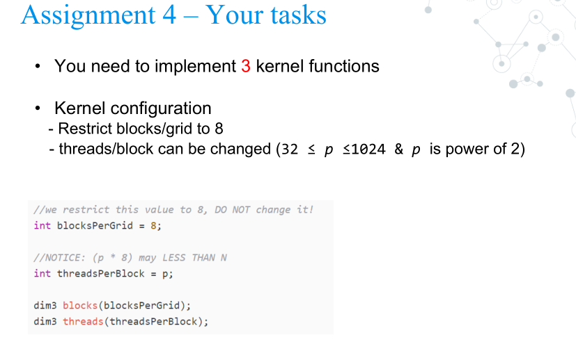
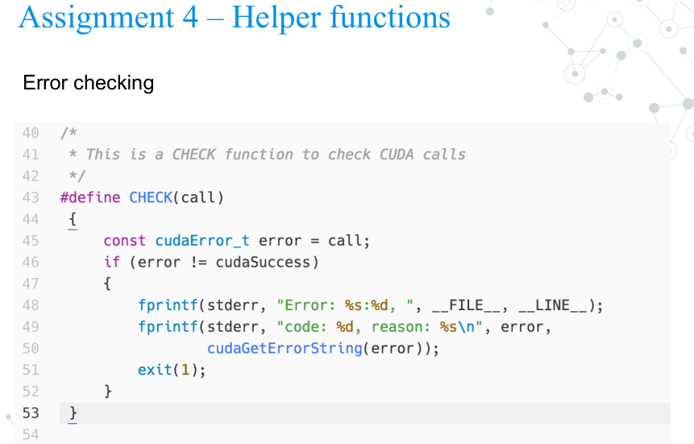
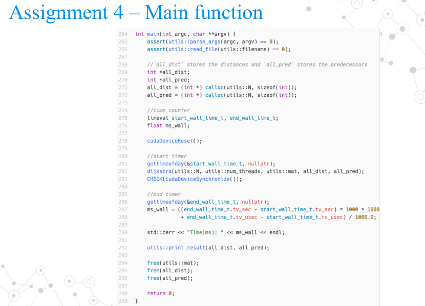
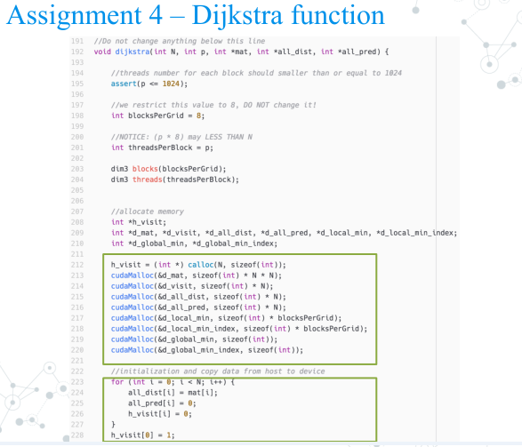
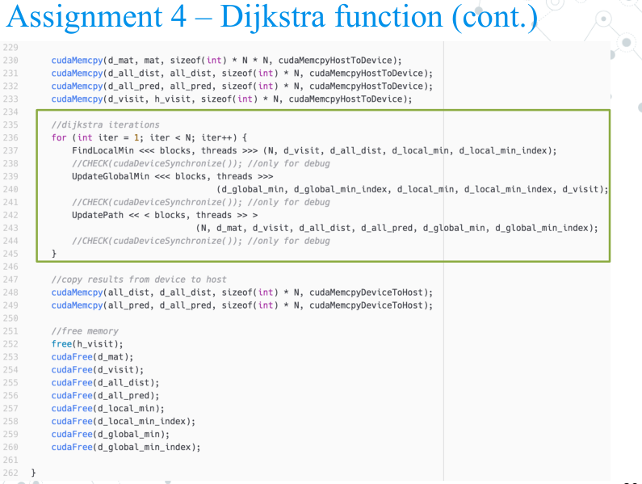
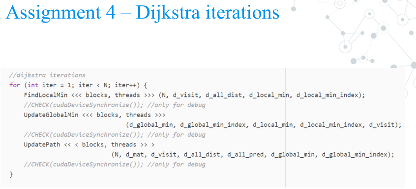
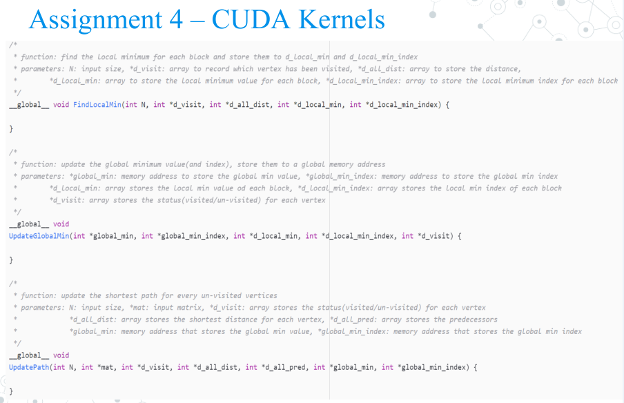
```
#include <string>
#include <cassert>
#include <iostream>
#include <fstream>
#include <vector>
#include <climits>
#include <cstring>
#include <cmath>
#include <algorithm>
#include <time.h>
#include <time.h>
#include "getopt.h"

#include "cuda_runtime.h"
#include "device_launch_parameters.h"

#include <stdio.h>
#include <Windows.h>

int gettimeofday(struct timeval * tp, void *tzp)
{
    time_t clock;
    struct tm tm;
    SYSTEMTIME wtm;
    GetLocalTime(&wtm);
    tm.tm_year = wtm.wYear - 1900;
    tm.tm_mon = wtm.wMonth - 1;
    tm.tm_mday = wtm.wDay;
    tm.tm_hour = wtm.wHour;
    tm.tm_min = wtm.wMinute;
    tm.tm_sec = wtm.wSecond;
    tm.tm_isdst = -1;
    clock = mktime(&tm);
    tp->tv_sec = clock;
    tp->tv_usec = wtm.wMilliseconds * 1000;
    return (0);
}


using std::string;
using std::cout;
using std::endl;
using std::vector;
using std::ceil;
using std::memcpy;

#define INF 1000000

/*
* This is a CHECK function to check CUDA calls
*/
#define CHECK(call)                                                            \
{                                                                              \
    const cudaError_t error = call;                                            \
if (error != cudaSuccess)                                                  \
{                                                                          \
    fprintf(stderr, "Error: %s:%d, ", __FILE__, __LINE__);                 \
    fprintf(stderr, "code: %d, reason: %s\n", error, \
    cudaGetErrorString(error));                                    \
    exit(1);                                                               \
}                                                                          \
}

/*
* utils is a namespace for utility functions
* including I/O (read input file and print results) and one matrix dimension convert(2D->1D) function
*/
namespace utils {
    int num_threads; //number of thread
    int N; //number of vertices
    int *mat; // the adjacency matrix

    string filename; // input file name
    string outputfile; //output file name, default: 'output.txt'

    void print_usage() {
        cout << "Usage:\n" << "\tcuda_dijkstra -n <number of threads per block> -i <input file>" << endl;
        exit(0);
    }

    int parse_args(int argc, char **argv) {
        filename = "";
        outputfile = "output.txt";
        num_threads = 0;

        int opt;
        if (argc < 2) {
            print_usage();
        }
        while ((opt = getopt(argc, argv, "n:i:o:h")) != EOF) {
            switch (opt) {
            case 'n':
                num_threads = atoi(optarg);
                break;
            case 'i':
                filename = optarg;
                break;
            case 'o':
                outputfile = optarg;
                break;
            case 'h':
            case '?':
            default:
                print_usage();
            }
        }
        if (filename.length() == 0 || num_threads == 0)
            print_usage();
        return 0;
    }

    /*
    * convert 2-dimension coordinate to 1-dimension
    */
    int convert_dimension_2D_1D(int x, int y) {
        return x * N + y;
    }

    int read_file(string filename) {
        std::ifstream inputf(filename, std::ifstream::in);
        inputf >> N;
        assert(N < (1024 * 1024 *
            20)); // input matrix should be smaller than 20MB * 20MB (400MB, we don't have too much memory for multi-processors)
        mat = (int *)malloc(N * N * sizeof(int));
        for (int i = 0; i < N; i++)
        for (int j = 0; j < N; j++) {
            inputf >> mat[convert_dimension_2D_1D(i, j)];
        }

        return 0;
    }

    string format_path(int i, int *pred) {
        string out("");
        int current_vertex = i;
        while (current_vertex != 0) {
            string s = std::to_string(current_vertex);
            std::reverse(s.begin(), s.end());
            out = out + s + ">-";
            current_vertex = pred[current_vertex];
        }
        out = out + std::to_string(0);
        std::reverse(out.begin(), out.end());
        return out;
    }

    int print_result(int *dist, int *pred) {
        std::ofstream outputf(outputfile, std::ofstream::out);
        outputf << dist[0];
        for (int i = 1; i < N; i++) {
            outputf << " " << dist[i];
        }
        for (int i = 0; i < N; i++) {
            outputf << "\n";
            if (dist[i] >= 1000000) {
                outputf << "NO PATH";
            }
            else {
                outputf << format_path(i, pred);
            }
        }
        outputf << endl;
        return 0;
    }
}//namespace utils


//------You may add helper functions and global variables here------

/*
* function: find the local minimum for each block and store them to d_local_min and d_local_min_index
* parameters: N: input size, *d_visit: array to record which vertex has been visited, *d_all_dist: array to store the distance,
*        *d_local_min: array to store the local minimum value for each block, *d_local_min_index: array to store the local minimum index for each block
*/
__global__ void FindLocalMin(int N, int *d_visit, int *d_all_dist, int *d_local_min, int *d_local_min_index) {
    //给每个block分配节点，一个线程对应一个节点，求出一个block的局部最小
    int element_per_thread = (int)ceil(N*1.0 / (blockDim.x*gridDim.x));
    //存储每个线程的最小值,一个线程对应一个节点
    __shared__ int thread_local_min[1024];//共享内存存储每个线程找到的最小值
    __shared__ int thread_local_min_index[1024];

    int threadID = blockIdx.x*blockDim.x + threadIdx.x;
    
    int my_start = threadID*element_per_thread;//当前线程块要找的点的范围start——end，若不能整除，最后一个线程块处理的要少一些；
    int my_end = my_start + element_per_thread;
    if (my_end > N)
    {
        my_end = N;
    }

    thread_local_min[threadIdx.x] = INT_MAX;//设定当前线程最小值
    thread_local_min_index[threadIdx.x] = -1;

    for (int i = 0; i<element_per_thread; i++)
    {
        int gindex = threadID*element_per_thread + i;//计算当前节点在全局中的位置
        if (gindex<N)
        {
            if (!d_visit[gindex])
            {
                if (d_all_dist[gindex] < thread_local_min[threadIdx.x])
                {
                    thread_local_min[threadIdx.x] = d_all_dist[gindex];
                    thread_local_min_index[threadIdx.x] = gindex;
                }
            }
        }
    }

    __syncthreads();

    //用该block的第一个局部线程计算局部最小
    if (threadIdx.x == 0)
    {
        d_local_min[blockIdx.x] = INT_MAX;
        d_local_min_index[blockIdx.x] = -1;
        for (int i = 0; i < blockDim.x; i++)
        {
            if (thread_local_min[i] < d_local_min[blockIdx.x])
            {
                d_local_min[blockIdx.x] = thread_local_min[i];
                d_local_min_index[blockIdx.x] = thread_local_min_index[i];
            }
        }
    }
    __syncthreads();
}

/*
* function: update the global minimum value(and index), store them to a global memory address
* parameters: *global_min: memory address to store the global min value, *global_min_index: memory address to store the global min index
*        *d_local_min: array stores the local min value od each block, *d_local_min_index: array stores the local min index of each block
*        *d_visit: array stores the status(visited/un-visited) for each vertex
*/
__global__ void
UpdateGlobalMin(int *global_min, int *global_min_index, int *d_local_min, int *d_local_min_index, int *d_visit) {
    if (blockIdx.x == 0){
        *global_min = INT_MAX;
        *global_min_index = -1;
        for (int i = 0; i < gridDim.x; i++){
            if (d_local_min[i] < *global_min){
                *global_min = d_local_min[i];
                *global_min_index = d_local_min_index[i];
            }
        }
    }
}

/*
* function: update the shortest path for every un-visited vertices
* parameters: N: input size, *mat: input matrix, *d_visit: array stores the status(visited/un-visited) for each vertex
*             *d_all_dist: array stores the shortest distance for each vertex, *d_all_pred: array stores the predecessors
*             *global_min: memory address that stores the global min value, *global_min_index: memory address that stores the global min index
*/
__global__ void
UpdatePath(int N, int *mat, int *d_visit, int *d_all_dist, int *d_all_pred, int *global_min, int *global_min_index) {
    int element_per_thread = (int)ceil(N*1.0 / (blockDim.x*gridDim.x));
    
    int threadID = blockDim.x*blockIdx.x + threadIdx.x;
    d_visit[*global_min_index] = 1;
    int u = *global_min_index;
    for (int i = 0; i < element_per_thread; i++)//每个线程要处理的点
    {
        int gindex = threadID*element_per_thread + i;
        if (gindex < N)
        {
            if (!d_visit[gindex])
            {
                int new_dist = d_all_dist[u] + mat[u*N + gindex];//计算当前全局最小到所有其他节点的新距离
                if (new_dist < d_all_dist[gindex])//若新值小于原先源点到该点的距离，更新
                {
                    d_all_dist[gindex] = new_dist;
                    d_all_pred[gindex] = u;
                }
            }
        }
    }
    
}

//Do not change anything below this line
void dijkstra(int N, int p, int *mat, int *all_dist, int *all_pred) {

    //threads number for each block should smaller than or equal to 1024
    assert(p <= 1024);

    //we restrict this value to 8, DO NOT change it!
    int blocksPerGrid = 8;

    //NOTICE: (p * 8) may LESS THAN N
    int threadsPerBlock = p;

    dim3 blocks(blocksPerGrid);
    dim3 threads(threadsPerBlock);


    //allocate memory
    int *h_visit;
    int *d_mat, *d_visit, *d_all_dist, *d_all_pred, *d_local_min, *d_local_min_index;
    int *d_global_min, *d_global_min_index;

    h_visit = (int *)calloc(N, sizeof(int));
    cudaMalloc(&d_mat, sizeof(int)* N * N);
    cudaMalloc(&d_visit, sizeof(int)* N);
    cudaMalloc(&d_all_dist, sizeof(int)* N);
    cudaMalloc(&d_all_pred, sizeof(int)* N);
    cudaMalloc(&d_local_min, sizeof(int)* blocksPerGrid);
    cudaMalloc(&d_local_min_index, sizeof(int)* blocksPerGrid);
    cudaMalloc(&d_global_min, sizeof(int));
    cudaMalloc(&d_global_min_index, sizeof(int));

    //initialization and copy data from host to device
    for (int i = 0; i < N; i++) {
        all_dist[i] = mat[i];
        all_pred[i] = 0;
        h_visit[i] = 0;
    }
    h_visit[0] = 1;

    cudaMemcpy(d_mat, mat, sizeof(int)* N * N, cudaMemcpyHostToDevice);
    cudaMemcpy(d_all_dist, all_dist, sizeof(int)* N, cudaMemcpyHostToDevice);
    cudaMemcpy(d_all_pred, all_pred, sizeof(int)* N, cudaMemcpyHostToDevice);
    cudaMemcpy(d_visit, h_visit, sizeof(int)* N, cudaMemcpyHostToDevice);

    //dijkstra iterations
    for (int iter = 1; iter < N; iter++) {
        FindLocalMin << < blocks, threads >> > (N, d_visit, d_all_dist, d_local_min, d_local_min_index);
        //CHECK(cudaDeviceSynchronize()); //only for debug
        UpdateGlobalMin << < blocks, threads >> >
            (d_global_min, d_global_min_index, d_local_min, d_local_min_index, d_visit);
        //CHECK(cudaDeviceSynchronize()); //only for debug
        UpdatePath << < blocks, threads >> >
            (N, d_mat, d_visit, d_all_dist, d_all_pred, d_global_min, d_global_min_index);
        //CHECK(cudaDeviceSynchronize()); //only for debug
    }

    //copy results from device to host
    cudaMemcpy(all_dist, d_all_dist, sizeof(int)* N, cudaMemcpyDeviceToHost);
    cudaMemcpy(all_pred, d_all_pred, sizeof(int)* N, cudaMemcpyDeviceToHost);

    //free memory
    free(h_visit);
    cudaFree(d_mat);
    cudaFree(d_visit);
    cudaFree(d_all_dist);
    cudaFree(d_all_pred);
    cudaFree(d_local_min);
    cudaFree(d_local_min_index);
    cudaFree(d_global_min);
    cudaFree(d_global_min_index);

}

int main(int argc, char **argv) {
    assert(utils::parse_args(argc, argv) == 0);
    assert(utils::read_file(utils::filename) == 0);

    //`all_dist` stores the distances and `all_pred` stores the predecessors
    int *all_dist;
    int *all_pred;
    all_dist = (int *)calloc(utils::N, sizeof(int));
    all_pred = (int *)calloc(utils::N, sizeof(int));

    //time counter
    timeval start_wall_time_t, end_wall_time_t;
    float ms_wall;

    cudaDeviceReset();

    //start timer
    gettimeofday(&start_wall_time_t, nullptr);
    dijkstra(utils::N, utils::num_threads, utils::mat, all_dist, all_pred);
    CHECK(cudaDeviceSynchronize());

    //end timer
    gettimeofday(&end_wall_time_t, nullptr);
    ms_wall = ((end_wall_time_t.tv_sec - start_wall_time_t.tv_sec) * 1000 * 1000
        + end_wall_time_t.tv_usec - start_wall_time_t.tv_usec) / 1000.0;

    std::cerr << "Time(ms): " << ms_wall << endl;

    utils::print_result(all_dist, all_pred);

    free(utils::mat);
    free(all_dist);
    free(all_pred);

    return 0;
}

```

* 并行效率分析
在自己的笔记本上跑不出来什么好的效果，昨天在工作站上用4核CPU跑的MPI，5000个点很快。不知道CUDA会不会更快。数据量还是不够大。

下面是在笔记本上的运行结果。并行算法用到的MPI函数主要为点对点通信函数MPI_Send和MPI_Recv，全局通信函数MPI_Bcast，MPI_Allreduce。MPI名字起的真好，消息传递编程，我觉得MPI算法的核心就是任务的划分和任务间的通信。
实验数据input1.txt和input2.txt。input1包含16个节点，input2包含5000个节点。input1.txt如下图所示
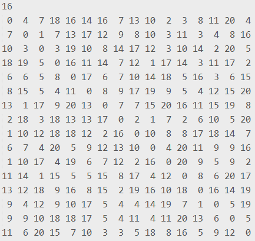
运行程序生成可执行文件，将其拷贝到对应文件夹下（如下图所示）
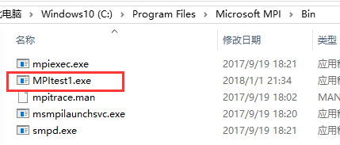
打开shell窗口，将位置导航到cpp文件夹所在的文件夹下，执行以下命令：
mpiexec -n <num_prossessor> 程序名称 <inputfile>
例如：mpiexec -n 4 MPItest1 input2.txt
输出结果（下图第一个的为输入input1.txt,第二个的输入为input2.txt）中所用时间为开启的4个线程分别用的时间，可以看到无论输入数据只有16个点还是有5000个点，进程1所用时间几乎是进程2、3、4的两倍，节点几乎是平均分配的，按照程序中的分配原则，只有最后一个进程分配到的节点数量可能比前面的要少一些。0号进程运行时间长应该是因为我计时的程序并不仅仅是dijkstra算法这一部分，还包括了其他比如I/O的时间。而这一部分是由0号进程去做的。下图第一个是在两个测试集上运行的结果，第二个为程序的输出。
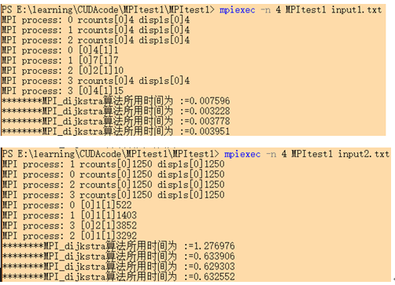
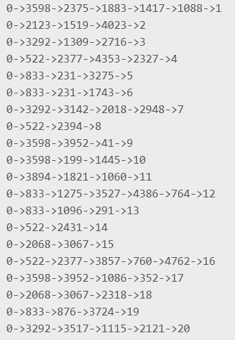