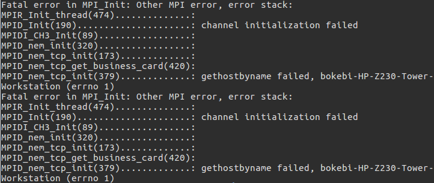
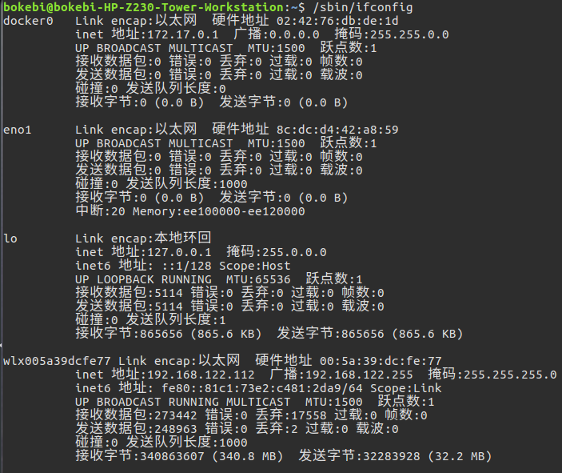
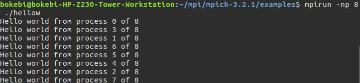
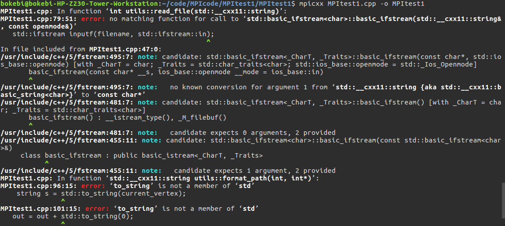
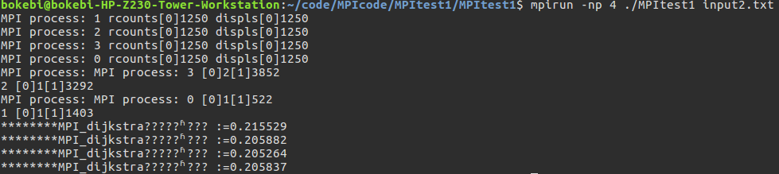

1. 参考[http://blog.csdn.net/qq_30239975/article/details/77703321](http://blog.csdn.net/qq_30239975/article/details/77703321)进行安装
但是在安装完成之后报错了 *gethostbyname failed, PC-Name.*

<!--more-->


经过检查解决方法如下：
```
sudo gedit /etc/hosts
```
首先通过/sbin/ifconfig查看网络信息

要用的是inet地址，也就是我们常说的IP地址
添加如下信息ip PCname PCname到hosts文件的末尾
例如:
```
192.168.122.112 bokebi-HP-Z230-Tower-Workstation bokebi-HP-Z230-Tower-Workstation
```
然后就可以正常运行MPI了
cd 进入MPI安装目录下的example目录
```
mpicc hellow.c -o hellow
mpirun -np 4 ./hellow
```


将win10上在VS中写的MPI程序放在Linux上用mpixx编译时报错了

```
"to_string“ is not a member of 'std'
```
参考文章[http://blog.csdn.net/u012675539/article/details/49960043](http://blog.csdn.net/u012675539/article/details/49960043)
具体原因我还没搞懂，但是添加了一些命令约束后就可以运行了，但是任然有中文乱码，想必是文件编码的问题，回头再解决吧。
用以下命令运行了MPI版本的dijkstra算法，结果截图如下
```
mpicxx -std=c++11 -D_GLIBCXX_USE_C99 MPItest1.cpp -o MPItest1
mpirun -np 4 ./MPItest1 input2.txt
```

MPI的加速真的不是盖的,5000个点的dijkstra串行的算法跑了好久，但用MPI一下下就跑完了，4个进程比8个进程快很多，因为工作站是4核的，如果设为8个进程，那么进程间的切换开销就非常大了。