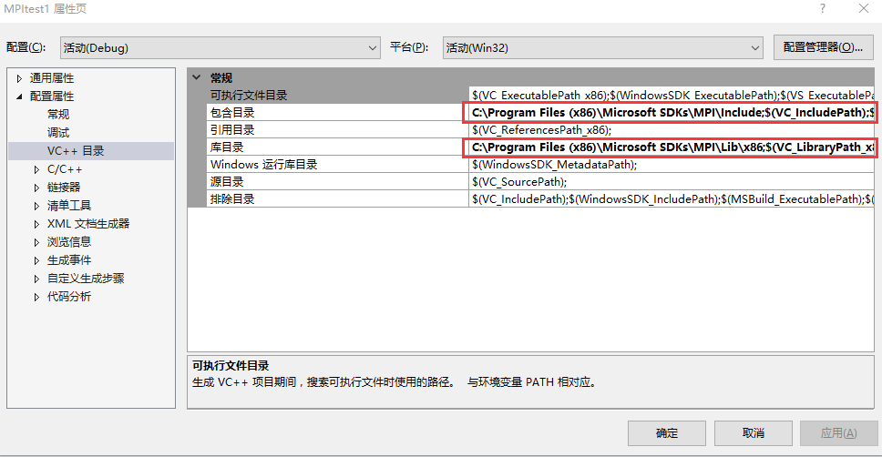
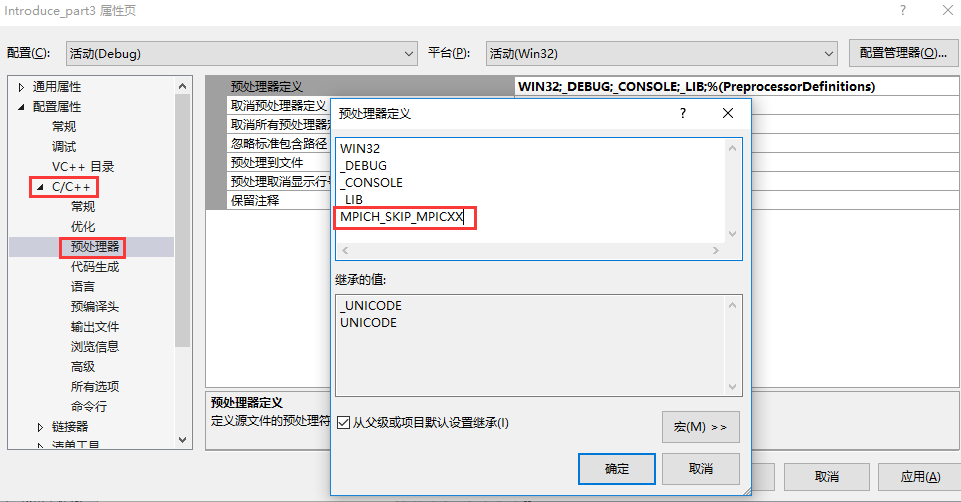
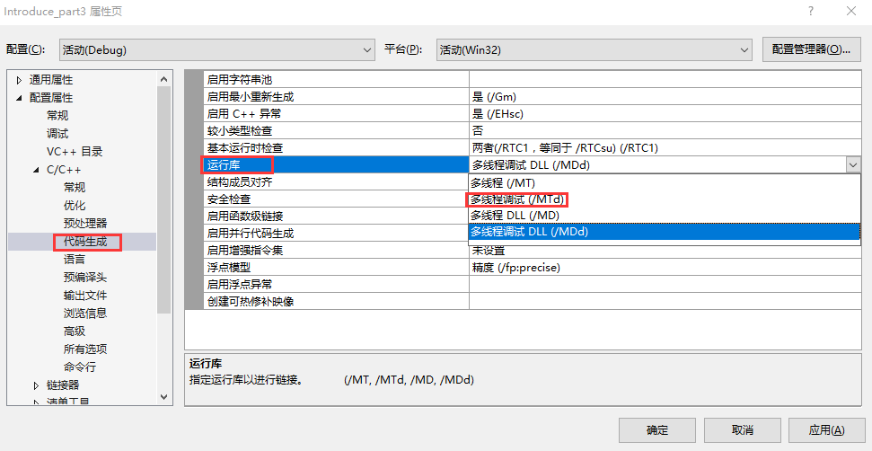
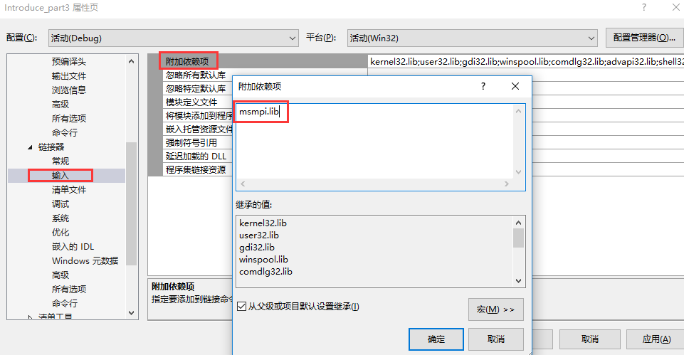
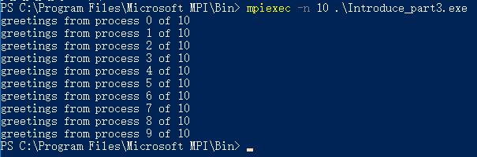
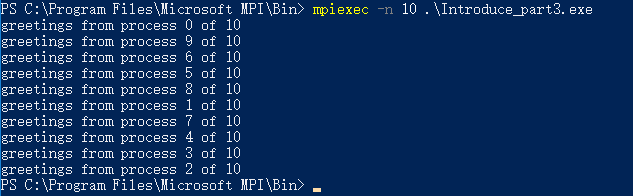

## 下载并安装MPICH For Windows

MPI是一个接口规范，我们使用的是它的实现MPICH。

首先，进入 [http://www.mpich.org/downloads/](http://www.mpich.org/downloads/) 站点根据操作系统下载。由于我们使用的是Windows，拉到下载网页最底部，最新的MPICH实现已经由微软官网托管，我们直接进去下载.包含两个文件：msmpisdk.msi和MSMpiSetup.exe。下载完毕直接分别安装这两个程序，都点下一步下一步即可。

<!--more-->

## 配置VS并写个HelloWord测试

首先新建一个win32应用程序，在项目属性中进行如下配置。



包含目录里面添加：C:\Program Files (x86)\Microsoft SDKs\MPI\Include;
库目录的里面添加：C:\Program Files (x86)\Microsoft SDKs\MPI\Lib\x86;
我这里因为虽然是64位的系统单安装VS时装的32位的，所以要写x86，小伙伴们大多数都应该是64位的改为C:\Program Files (x86)\Microsoft SDKs\MPI\Lib\x64;就好了。

>  其他必要配置：

*配置管理器，选择x86编译平台；* 

* C/C++ -> 预处理器，添加：MPICH_SKIP_MPICXX;
* C/C++ -> 代码生成 -> 运行库，选择：多线程调试（/MTd）;
* 链接器 -> 输入 -> 附加依赖项，添加：msmpi.lib;





## helloworld测试

```
#include "stdafx.h"
#include <stdio.h> 
#include <mpi.h>
#include<iostream>
#include<string.h>
using namespace std;

const int MAX_STRING = 100;
int main(int argc, char *argv[])
{
    char greeting[MAX_STRING];
    int comm_sz;
    int my_rank;
    char processor_name[MPI_MAX_PROCESSOR_NAME];
    int namelen;

    MPI_Init(&argc, &argv);
    MPI_Comm_size(MPI_COMM_WORLD , &comm_sz);
    MPI_Comm_rank(MPI_COMM_WORLD, &my_rank);
    MPI_Get_processor_name(processor_name, &namelen);
    if (my_rank != 0){
        sprintf_s(greeting, "greetings from process %d of %d", my_rank, comm_sz);
        MPI_Send(greeting, MAX_STRING, MPI_CHAR, 0, 0, MPI_COMM_WORLD);
    }
    else{
        printf("greetings from process %d of %d\n", my_rank, comm_sz);
        for (int q = 1; q < comm_sz; q++)
        {
            MPI_Recv(greeting, MAX_STRING + 1, MPI_CHAR, q, 0, MPI_COMM_WORLD, MPI_STATUSES_IGNORE);
            printf("%s\n", greeting);
        }
    }
    
    MPI_Finalize();
    return 0;
}
```

```
MPI_Send(
    void* msg_buf_p;        // in 指向包含消息内容的内存块指针
    int msg_size;           // in 指定要发送的数据的数量
    MPI_Datatype msg_type;  // in 发送的数据类型
    int dest;               // in 接收消息的进程号
    int tag;                // in 非负int，用来区分不同的消息
    MPI_Comm communicator;  // in 指定通信范围
)
```

```
MPI_Recv(
    void* msg_buf_p;        // out 指向内存块
    int msg_size;           // in 指定内存块要存储的对象数量
    MPI_Datatype msg_type;  // in 接收的数据类型
    int source;               // in 消息来源的进程号
    int tag;                // in 非负int，用来区分不同的消息
    MPI_Comm communicator;  // in 指定通信范围
    MPI_Status* status_p    // out 大多数情况复位MPI_STATUS_IGNORE
)
```

如果进程q调用了MPI_Send(),进程r调用了MPI_Recv(),当满足以下条件时可以完成消息传递：

* recv_comm=send_comm
* recv_tag=send_tag
* dest=r
* src=q
* recv_type=send_type
* recv_buf_sz >= send_buf_sz


编译整个项目，将编译得到的exe文件（debug文件夹下）放在安装的MS-MPI的bin目录（默认为：C:\Program Files\Microsoft MPI\Bin）下，在这个Bin目录下按住shift键于空白处右键单击，打开命令行窗口，输入 mpiexec -n 10 MPI-demo.exe 得到运行结果，如下图



当MPI_Recv中的source指定为MPI_ANY_SOURCE时，就可以按照各个线程完成工作的顺序来传递消息了。


 