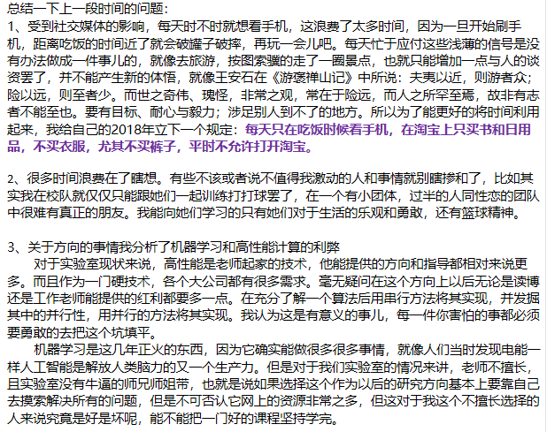
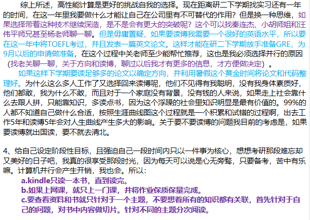
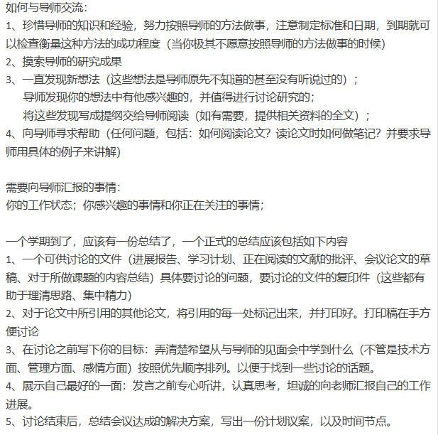
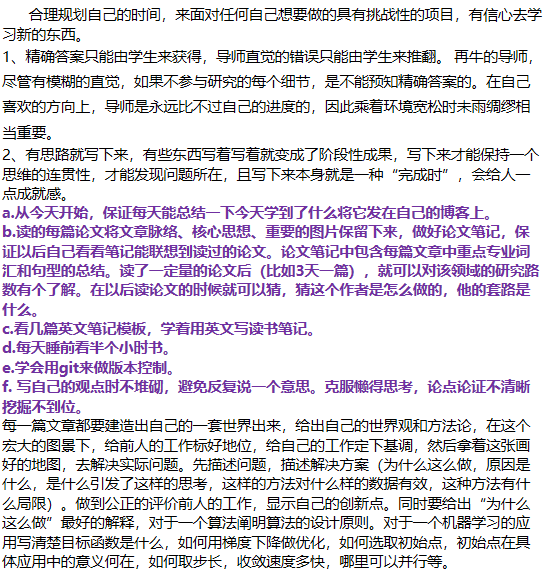
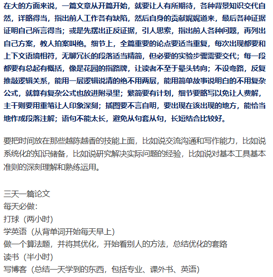

今天基本上研一的所有课程都结束了，而且又是新的一年，关于以后的发展方向和选择都应该有个规划，我现在主要在思考的问题有以下两个：

1. 要不要读博
2. 是继续做数据分析还是做高性能计算

[这位博士的几年总结，或许能解答你许多问题](<http://blog.sciencenet.cn/blog-81613-960572.html>)

从上面的文章中，讲到了一点，读博就是学会怎样去做一件大一点的事情。在现在这个浮躁的社会中，每个人都想一口吃成胖子，但是心急不配做高手。

<!--more-->






接下来的工作

1. 并行IO库
2. prpl改造：非阻塞通信
3. 加入GPU：CPU/GPU异构并行

编码过程：
```
模块化，每个模块的输入什么-输出什么
粒度搞细，每个模块都可以在下次拿出来直接使用
```

```
并行计算的思维过程：
串行算法有什么问题(能否并行化)
并行算法的问题(哪种并行的方式最好)
异构算法的问题(还有哪些可以优化的部分)
```