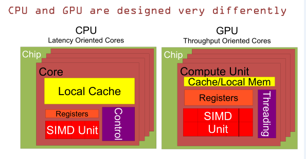
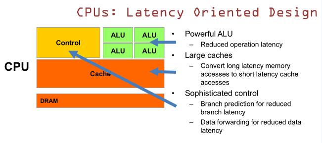
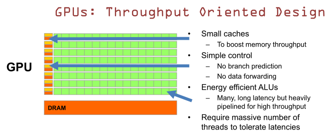

## 异构并行计算Heterogeneous_Parallel_Computing简介

> 主要内容

* 学习延迟设备(CPU)和吞吐设备(GPU)之间的主要区别
* 为什么越来越多的应用同时使用这两种设备

<!--more-->

>  CPU与GPU的区别

1. CPU有更大的局部cache，GPU有相对小的cache和局部内存。
2. GPU有更多的寄存器，支持大量的线程。而CPU只有能够支持少量线程的寄存器。
3. GPU有更多的SIMD执行单元；
4. CPU有复杂的控制器，CPU有简单的控制单元，但是有大量的线程需要管理

>  CPU特性：CPU延迟敏感，以减少延迟为目标

上图中的三个特性解释如下：

1. 强大的ALU，减少操作延迟：ALU(算术逻辑单元)被设计的很强大，可以在几个时钟周期中进行数值计算。现在的CPU核心中，64位双精度浮点运算，加法运算、乘法运算只需要花费1-3个时钟周期。 这些时钟频率非常高。
2. 大的缓存：将长时间的访问延迟转为更短的访问延迟；将尽可能多的数据放入缓存中，所以，将下一时刻更有可能被访问到的数据放入cache中。
3. 复杂的控制
    * 使用分值预测来减少分支延迟：分支指令由控制指令产生(if...else,loops)，让硬件能够预测出下一次会走哪一个分支，就可以及时获取到下个时间要执行的指令。但是当预测出错时得用足够的处理器从错误的预测中恢复，因此我们需要将资源放入控制逻辑来支持分支预测和恢复错误。 
    * 数据转发以减少数据延迟；当一些指令需要同一个指令的输出结果时，数据分发决定了那些指令在流水线的哪个地方，并通过最快的方式将数据路由过去。这个过程涉及到大量的对比电路单元和转发电路单元，会耗费很多的运行能力。

结论：CPU运算速度更快，指令周期短，即便是双精度的浮点数乘法也只需要1~3个时钟周期。

>  GPU特性：以提升吞吐量为目标的结构设计

上图中GPU的四个特性解释如下：
 
1. 很小的缓存————提高内存吞吐量：这些缓存并不是用来保存未来可能访问到的数据，而是作为大量线程的阶段性单位，是为thread提高服务的；如果有很多线程需要用相同的数据同时执行，cache会将这些需求整合成一个，由这一个请求去访问DRAM(dynamic random access memory)（因为需要访问的数据保存在dram中而不是cache里面）数据取回来以后，cache转发数据给所有需要这些数据的执行单元或者线程。但是由于需要访问DRAM，访问DRAM的延迟依然存在，然而这个逻辑可以将多次访问整合为一个，因此我们可以保证访问DRAM的traffic。
2. 简单控制
    * 无分支预测
    * 无数据转发
3. 高效节能的ALU
    * 很多高延迟但对于高吞吐量的GPU来说是流水线操作，GPU没有使用少量的功能强大低延迟的ALUs，而是使用大量的高延迟且非常节能ALUs，所以这些ALUs通常在流水线中，所以它们每个时钟周期接受一个操作，然后每个操作用很长的时间来产生结果。每个时钟周期会有一个结果从流水线输出，作为ALU的输出。因此有这么多的ALUs，且对于每个ALU都有很长的流水线，我们必须有大量的线程。为了充分的应用硬件资源，每个线程进行算数操作，能在一个阶段被这些ALU执行。在高吞吐量的情况下，如果我们有大量的线程，每个线程同时进行操作，我们就能够充分利用大量的ALU来计算。然而每个线程会花费大量的时间来执行任务，相较于CPU中对应的功能单元，每个操作都会花费大量的时间执行一个操作。
4. 需要大量的线程来抵消延迟
    GPU的虽然有DRAM延时，却有非常多的ALU和非常多的thread. 为了平衡内存延时的问题，我们可以中充分利用多的ALU的特性达到一个非常大的吞吐量的效果。尽可能多的分配多的Threads.通常来看GPU ALU会有非常重的pipeline就是因为这样。

结论：GPU可以达到很好的吞吐量。

对比：CPU擅长逻辑控制，串行的运算。和通用类型数据运算不同，GPU擅长的是大规模并行计算。所以GPU除了图像处理，也越来越多的参与到计算当中来。在数据吞吐量很大的时候GPU的计算速度很容易达到CPU的十倍甚至百倍，同样，对于程序中的线性部分，CPU也很容易达到GPU的十倍或者更多。所以现在越来越多的软件同时使用CPU和GPU，

控制单元包括程序计数器(program counter)和指令寄存器(instruction register)。PC实际上定义了内存中的位置，使得硬件能够找到应用下一条要执行的指令的位置。从控制单元到memory有一条虚线，程序计数器从内存中取回指令。指令一旦取回来，理科放入指令寄存器(IR)中，

>  word

| word      | chinese | synonym   |
| --------- |:-----:| -----:|
| heterogeneous  | 异构的  |   |
| versatile  | adj.多才多艺的 多面手|  |
| definitely  | adv.无疑，明确地 | undoubtedly，explicitly   |
| sophisticated | adj.复杂的  |  intricate |
| consolidate | v.巩固，整合  |   |
| scalability | n.可扩展性  |   |
| portability | n.可移植性  |   |
| latency-oriented | 延时为导向 |  |
| through-oriented | 吞吐为导向 |  |
| exploiation | n.开发   |   |
| hierarchical | adj.分级   |   |
| criteria | n.标准   |   |
| terminate | v.终止   |   |
| micro-architecture| n.微架构   |   |
| circuites | n.电路 |   |
| electrons | n.电子 |   |
| interpreted | v.解读  |   |     
| diagram |  n.图  |   |
| dash line|  n.虚线   |   |
| back and forth | 来来回回 | |
| elaborate on | 详细说明，阐述 |  |

