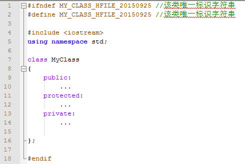
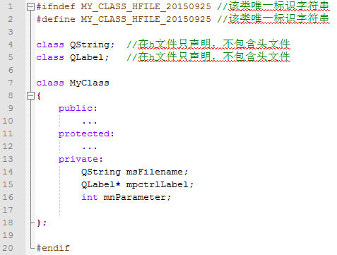
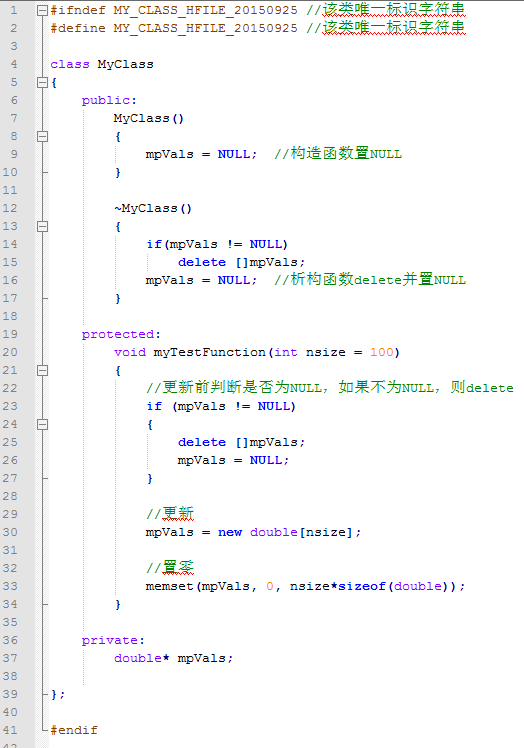
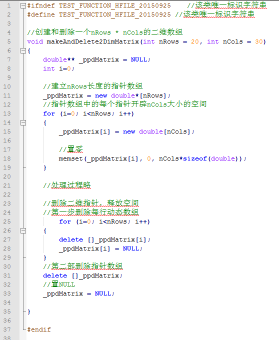

## C/C++程序变量和函数命名规范及注意事项
> 主要内容

* 函数命名规则（驼峰命名法）
* 变量命名规则（匈牙利命名法）
* 其他非常重要的注意事项
<!--more-->

### 函数命名规则（驼峰命名法）
普通函数：函数名由若干个单词组成，第一个单词全部小写，第二个单词开始首字母大写
```
bool getMeanValue(...);
int csvToShp(...);
double ** computeUrbanConversionMatrix(...);
```

**tips**

1. inline类型的函数，在函数名前面加下划线_：
```
    inline int _getCuberInterpolationValue(...);
```

2. 若为static类型的函数，函数名第一个单词首字母大写：
```
    static int OpenFiles(...);
```

### 变量命名规则（匈牙利命名法）

* 原则1：禁止使用简单英文单词命名变量，如min,max,left,right,会造成和某些库保留变量名冲突
* 原则2：**变量作用域(w/m/_/无)+指针/数组(p/pp/ppp/无)+变量类型(c/u/n/f/d/s/v 等)+变量名称**
* 原则3：迭代变量允许但不推荐使用i,j,k,n,m,尽量使用有意义的迭代变量名称，如`_nFilesIdx`

*表1：变量作用域命名规则*

| 变量作用域 | 前缀 | 例子   | 意义|
| ---------  |:-----:|: -----:|-----:|
| 全局变量  | w  | wnValue  | 全局int型变量 |
| 静态变量  | S(大写)  | SnValue  | 静态int型变量 |
| 类变量    | m  | mnValue  | 类int型变量 |
| 普通变量  | 不需要  | nValue  | int型变量 |
| 临时变量  | _  | _nValue  | 临时int型变量 |

*表2：指针/数组命名规则*

| 指针/数组 | 前缀 | 例子   | 意义|
| ---------  |:-----:|: -----:|-----:|
| 一维  | p  | pdValues  | 普通一维double型数组 |
| 二维  | pp  | ppdValues  | 普通2维double型数组 |
| 三维  | ppp | pppdValues  | 普通3维double型数组 |
| 非指针  | 无 | dValues  | 普通double型数组 |

*表3：变量类型命名规则*

| 指针/数组 | 前缀 | 例子   | 意义|
| ---------  |:-----:|: -----:|-----:|
| char  | c  | cValue  |  |
| unsigned char,byte  | u  | uValue  |  |
| short,unsigned short,int,unsigned int  | n  | nValue  |  |
| long,long long  | l  | lValue  |  |
| float  | f  | fVafue  |  |
| double  | d  | dVadue  |  |
| bool  | b  | bVabue  |  |
| char*,string  | s/str/sz  | strValue  |  |
| list,vector  | v  | vValues  | 链表/容器 |
| file  | in/out/fi  | inFile/outFile/fiOutput  | 输入输出文件 |
| map,hash  | map  | mapKeyValues  | 映射表/哈希表 |
| HANDLE  | h  | hDesktop  | 桌面句柄 |
| GDAL相关指针  | po  | poDataset  |  |
| 控件  | ctrl  | ctrlTextView  | TextView控件 |
| 源对象  | src  | srcString  | 源字符串 |
| 目的对象  | dst  | dstString  | 目的字符串 |

**例：**

```
double ** mppdDistanceMatrix;   //类内二维双精度型指针变量
QList<int>* wpvnValuesList;     //全局int型链表的指针
QList<int*> mvpnValueList;      //类内链表对象，存储int型指针
QProgressBar*mpctrlProgBar;     //类内ProgressBar控件指针对象
GDALDataset*mpoDataset;         //GDAL栅格数据集指针对象
```


### 其他非常重要的注意事项

1. 为了防止同一个文件被编译器多次编译，每个头文件(*.h)实现结构必须为：
```
#ifndef 随机唯一表示字符串，千万不要与其他头文件重复
#define 随机唯一表示字符串，千万不要与其他头文件重复
(类的实现)
...
...
#endif
```
e.g. 

2. 为了防止头文件互相包含造成编译错误，每个头文件(.h)中的include的其他头文件数量越少越好。或者只进行声明，在对应的实现文件(.cpp)中将所需头文件包含进来；
e.g.

3. 为防止内存泄露造成程序不稳定，在类和函数中声明的指针一定要先置NULL,或nullptr;每次使用前先判断是否为NULL,若需要更行，先delete再new;并在类的析构函数中或函数尾部对该指针delete并置NULL或nullptr处理.


