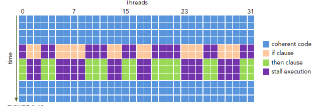

## 第四章：CUDA执行模型

> 主要内容

* CUDA如何在保持扩展性的前提下表达并行计算
* Warp与Half-warp的含义与重要性
* 调度、warp分歧以及GPU是SIMT架构的原因

<!--more-->

###  线程角度的GPU编程

CUDA性能与扩展性的本质来自于其可以将计算分割成固定大小的线程块的执行结构。这些线程块实现了GPU上大规模并行硬件之间的映射.GPU硬件的大规模并行是通过重复设置多个相同的通用构件块(流多处理器)来实现的。流多处理器的数量一定程度上决定了GPU的价格和性能。线程块的软件抽象将Kernel函数的一个自然映射转换到GPU上任意数量的流多处理器上。一个流多处理器可以调度执行一个或多个线程块。能调度线程块的数量仅仅由设备的性能所决定。也就是说每个流多处理器分配线程块的数量取决于一个流多处理器中最多能常驻的线程与线程块数量。

* 这种映射可以透明的扩展到任意数量的流多处理器上；
* 对流多处理器的位置没有限制(可以在多个设备上进行扩展)；
* 能够将执行中的Kernel与用户参数广播给硬件；并行广播是扩展性最强、速度最快的通信机制，能将数据移动到大量的处理单元上；

一个Block内的所有线程都会在一个流多处理器上执行，GPU设计者在流多处理器内部用共享内存在实现数据共享。这种方式避免了多核处理器中常出现的缓存不一致问题。确保缓存中的所有变量处于最新状态。

只要处于不同的流中，多个Kernel函数就可以在同一个GPU上同时执行。Kernel函数按照其发射顺序执行，只要前一个待执行的Kernel函数的所有线程都得到调度，且还有剩余的资源，就可以调度下一个Kernel函数。每个流多处理器独立调用内部资源、处理核心及其他执行单元，来执行为其分配的线程块内的线程。每个流多处理器执行相同的指令，处理不同的数据。

###  [性能角度的GPU编程](http://blog.163.com/wujiaxing009@126/blog/static/71988399201701224540201/)

以一个Warp或者半个Warp内部SIMD线程的数量为单位进行考虑。大多数GPU上一个Warp含有32个SIMD线程。Warp是流多处理器内部的基本调度单元。
使用基于线程块的无耦合全局与局部调度机制有很多优势：

* 全局调度器必须监控的只有活动状态的流多处理器；
* 每个流多处理器调度一个线程块降低了线程资源分配的复杂度以及流多处理器内线程间的通信，以可扩展的方式对Kernel进行分割，流多处理器升值全局调度器无需知道其他流多处理器中在进行什么工作。

**warp的执行**：每周期将一个warp的1条指令或者可以双发射的两条指令（scheduler）发射到流处理器sp(stream prossor)和其他的执行单元上，其中，并不一定将32个sp一组安排，同时，一个warp也并不是从开始到结束总在相同的32个sp上执行。

Warp内各个条件子句分支之间是串行执行的，所以条件子句导致执行速度降低2倍，N层嵌套分支会使得执行速度降低2的N次方。任何流控制指令（if\switch\do\for\while）都会导致线程分歧，线程分歧时会顺序执行每个分支路径，禁用不在此路径上的线程，直到所有路径完成，线程再重新汇合到同一执行路径。



主要有以下3种情况：

* 如果一个warp的32个线程都只满足同一个分支，这是所谓的“分支按warp对齐”的形式，此时分支基本不影响执行效率。
* 如果一个warp的32个线程分别满足多个分支，那么不满足当前分支的线程可能会采用插入等待或者假执行（跟着一起算，但是不保留结果）的方式，束内的每个线程都会对每个分支进行判定，如果判定满足，就会执行分支内的代码，如果不满足，线程会暂停等到其他线程执行完成，然后再一起执行下一步。总的运行时间是多个运行分支的时间之和，以及显然每次都有些线程不干活或者干无用功。
* 因为最小的执行单位就是warp，所以如果warp内不同线程的循环次数不同，那么这也是一种分支情况，并且时间是循环次数最多的那个线程所花费的时间。

CPU有复杂的硬件设计可以很好的做分支预测，即预测应用程序会走哪个path分支。如果预测正确，那么CPU只会有很小的消耗。和CPU对比来说，GPU就没那么复杂的分支预测了。因为所有同一个warp中的thread必须执行相同的指令，那么如果这些线程在遇到控制流语句时，如果进入不同的分支，那么同一时刻除了正在执行的分支外，其余分支都被阻塞了，十分影响性能。这类问题就是warp divergence。注意，warp divergence问题只会发生在同一个warp中。

####  [分支预测](http://blog.csdn.net/rrrfff/article/details/44993467)

分支预测（Branch Prediction）是现代处理器用来提高CPU执行速度的一种手段, 其对程序的分支流程进行预测, 然后预先读取其中一个分支的指令并解码来减少等待译码器的时间.维基百科上对此的解释是"a strategy in computer architecture design for mitigating the costs usually associated with conditional branches, particularly branches to short sections of code."

分支预测的错误并不会导致结果的错误，而只是导致流水线的停顿，如果能够保持较高的预测准确率，分支预测就能提高流水线的性能, 换言之, 如果在软件开发过程中, 能够考虑这一特性, 减少甚至移除条件分支(值得一提的是, 条件转移不需要预测, 因此条件转移也远没有产生错误分支的性能代价大), 能一定程度上提供程序的整体效率.

下面是几种常见的优化策略:

1. 避免在循环中嵌套条件分支. 如果可能,将分支移到外部, 使用多个子循环.

```
    do 
    {
        if (condition_1){
            //branch_1
        } else if (condition_2){
            //branch_2
        } else {
            //branch_3
        } //if
    } while (true);

    //改进版本
    if (condition_1) {
        do {
            //branch_1
        } while (true);
    } else if (condition_2) {
        do {
            //branch_2
        } while (true);
    } else {
        do {
            //branch_3
        } while (true);
    } //if
```

2. 合并分支条件.在某种情况下可以大大降低产生错误分支预测的概率.

```
    if (condition_1 == 0 || condition_2 == 0 || 
        condition_3 == 0) {
        //branch
    } //if

    //改进版本:
    if ((condition_1 | condition_2 | condition_3) == 0) {
        //branch
    } //if
```

3. 移除明显的条件分支, 将执行概率大的条件分支移前.这一条不仅仅有助于规避错误分支带来的性能惩罚, 还减少了不必要的检测分支条件消耗的CPU时钟周期.

编译器只有在条件分支控制的指令数小于或等于一个确定的阈值时，才会使用呢预测指令替换分支指令。如果编译器腿短条件会产生许多有分歧的warp，阈值为7，否则阈值为4.如果分支中的代码过长，nvcc编译器会插入代码执行warp表决。来查询warp所有线程是否都执行相同的分支。如果warp中所有线程都表决相同的执行分支，说明性能没有下降。

####  避免warp分歧(Warp Divergence)的准则

warp分歧有时候不可避免，尤其是树、图等不规则的数据结构。
下面是几种常见的避免准则：

1. 使用不同的算法重新规划问题，避免引起warp分歧，或者以编译器能够降低或消除warp分歧的方式表示问题。
2. 将不同计算代价的任务分别列表，每个列表使用一个独立的kernel函数。最好将大量工作在计算代价低的kernel中完成，一些计算代价高的任务也可以在CPU上完成。
3. 将计算任务排序并分块，块的大小为半个warp的整数倍。
4. 如果可以，使用异步kernel执行方式，充分利用SIMT的执行模型。
5. 使用主处理器来处理部分任务会造成GPU负载不均衡。

####   warp的资源划分(resource partition)

一个warp的context包括三个部分：

1. 程序计数器(program counter)
2. 寄存器(register)
3. 共享内存(shared memory)

每个SM有一个32位register集合放在register file中，还有固定数量的shared memory，这些资源都被thread瓜分了，由于资源是有限的，所以，如果thread数量比较多，那么每个thread占用资源就比较少，反之如果thread数量较少，每个thread占用资源就较多，这需要根据自己的需求作出一个平衡。资源限制了驻留在SM中blcok的数量，不同的GPU，register和shared memory的数量也不同。如果没有足够的资源，kernel的启动就会失败。当一个block获得足够多的资源时，就成为active block。block中的warp就称为active warp。SM中的warp调度器每个cycle会挑选active warp 送去执行。active warp又可以被分为3类：

1. 选中态 selected warp；
2. 挂起态 stalled warp；
3. 就绪态 eligible warp；

warp执行有两个条件：

* *32个CUDA core有空*
* *当所有当前指令的参数都准备就绪*

在同一个context中切换是没有消耗的，在SM内部硬件能够检测到已经准备就绪、等待执行下一条指令的warp，其所需的资源以及数据依赖关系已经解决。SM基于内部优先级调度，从就绪warp池中选择一个warp，将其发送到SIMD核心上。TLP(thread level parallel)的思想就是给调度器提供尽可能多的线程以供选择，进而使性能损失的可能性最小化。CUDA编程中应该重视对计算资源的分配，这些资源限制了active warp的数量。因此为了最大化GPU利用率，我们必须最大化active warp的数目。

NVIDIA 提供了CUDA占用率计算器来帮助我们选择执行配置。
####  通常的执行配置(网格的线程块数量)启发式规则包括

* 指定比SM数量多的线程块，保证所有的SM至少会分得一个Block执行。这是下线，指定比SM数量少的线程块很明显不能利用所有的GPU资源。
* 为了在小规模问题上充分运用kernel的异步执行，开发者会故意不完全使用GPU。GPU能够利用kernel的并行执行，在空闲的SM上执行其他kernel函数的线程块来提升性能。这些GPU能够加速以下程序：包含多个kernel函数，这些kernel函数尺寸太小，以至于无法使用PU上所有SM，而将其传输到CPU处理会太费时间。
* 为每个SM指定多个线程块，以便于在SM内部并行执行；
* 将block的数量选定为GPU内SM数量的整数倍，完全利用所有的SM，这种方法确保了所有SM负载均衡；
* 不处于__syncthreads的block会保持硬件繁忙
* 能够执行的block数量取决于SM中可使用的资源，包括寄存器，共享内存空间。
* 如果可能，为每个grid指定一个很大的block数量，这样做有利于程序运行在不同的GPU上，这将使SM满载分配给它的线程块。

#### 指令级并行ILP(instruction level parallel)：高性能低占用率

“指令级并行 ILP”的含义是：如果程序中相邻的一组指令是相互独立的，即不竞争同一个功能部件、不相互等待对方的运算结果、不访问同一个存储单元，那么它们就可以在处理器内部并行地执行。

上面提到的TLP通过尽可能使得SM占用率高来提升性能，然而高占用率不一定会转变为最佳应用性能。指令级并行在隐藏算数延迟中国也非常有效，它能以更少的线程保持SIMD核心忙碌，因此会消耗更少的资源，带来更少的开销。使用ILP的原因很简单：**使用较少的线程意味着每个线程可以使用更多的寄存器，寄存器是很珍贵的资源，是唯一足够快速并能够获得GPU峰值性能的存储器**。寄存器存储于其他内存之间的贷款差距越悬殊，就应该有越多的数据存储在寄存器中，以获得较高的性能。

使用少量的线程有以下好处：

1. 能为每个线程分配多一点寄存器防止寄存器溢出；
2. 使用少量的线程对使用shared memory的函数有利，这样做减少了对共享内存的访问，并允许线程内部的数据重用；
3. 减少了GPU对每个线程所进行必要处理所需的开销；

### 为了提高应用的并行性，需要考虑如下几点

Little(利特尔)法则：在一个稳定的系统中，长时间观察到的平均顾客数量L，等于，长时间观察到的有效到达速率λ与平均每个顾客在系统中花费的时间之乘积，即L = λW。在理解存储器层次结构时有重要用途。推广到多处理器系统，little法则可以表达为:
***Concurrency = bandwidth * latency***.其中concurrency表示总的系统并行度，bandwidth表示总的存储带宽。

* 寄存器   约为8TB/s
* 共享内存 约为1.6TB/s
* 全局内存 约为177GB/s

从TLP角度来看，little法则表明运行时的存储操作数量N是到达率λ和内存延迟的乘积。其中到达率是IPC(期望的指令速率)与加载指令密度的乘积。也就是说，当加入额外的线程并在同一硬件上多路复用时，可以隐藏很大的延迟。

从ILP角度来看，独立的访存事件能够被看成批处理(ILP合并提交的内存操作)
N=λL-B,其中B是合并的独立加载指令的数量。

为了提高应用的并行性，需要考虑如下几点：
* 提升占用率
* 使用nvcc命令行选项 -maxrregcount 最大化可用寄存器，或者在Kernel函数声明时让编译器使用 __launch_bounds__ 给每个kernel函数分配额外的寄存器；
* 调整线程块的维度以最好的利用SM处理器warp调度器
* 修改代码以利用ILP使得每个线程处理多个元素，进行指令级并行；
* 不要在一个功能单元上出现瓶颈，从而导致其他单元停滞
* 不要把工作都放到一个kernel代码中：1、尝试创建多个小的线程块，使其操作(例如阵型，浮点型，内存以及SFU)密度均匀分布。2、不要将相同类型的操作聚集到kernel函数的同一部分，这样回使得SM负载不均衡。因为每个SM可以执行不同的kernel，所以将kernel的粒度弄的小一点更有助于负载均衡，这里让我想到了那个向瓶子里装石头的故事，大石头装完了还有很多空隙，可以装小石头，当然如果都是沙子，那一定能更好的利用瓶子的空间，这里将kernel中的功能细分也是这个目的。

### nvcc编译器

nvcc编译器为UNIX、Windows、Mac OS X 操作系统提供了通用的编译架构。CUDA的编译器为nvcc,nvcc将各种编译工具集成起来，这些编译工具实现了编译的不同阶段。nvcc的基本工作流是将device代码从host代码中分离出来，然后将其编译成二进制或者cubin工程。在执行过程中，将忽略host代码，而将device代码加载并通过CUDA的设备API来执行。CUDA源代码在编译器前端是基于c++语法的。host代码中能够全部支持C++，但是在device中只能支持c++中的C部分。在kernel中不允许有C++的类、继承以及在基本块中定义变量等语法。C++中的void类型指针不能在没有类型转化的前提下赋值给一个非void的指针。

#### #pragma unroll 循环展开
nvcc编译器提供了#pragma unroll预编译指令，用来将循环展开。
编译器在编译时会对循环进行展开，比如对一些循环次数比较少的循环：

```
for(int i=0;i<4;i++)
    cout<<"hello world"<<endl;
```
可以展开为：
```
cout<<"hello world"<<endl;

cout<<"hello world"<<endl;

cout<<"hello world"<<endl;

cout<<"hello world"<<endl;
```
这样程序的运行效率会更好，当然，现在大多数编译器都会自动这样优化，而通过使用#pragma unroll命令就可以控制编译器的对循环的展开程度。
看下面这段代码
```
int main()
{
    int a[100];

#pragma unroll 4

    for(int i=0;i<100;i++)
    {
        a[i]=i;
    }

    return 0;
}
```
它的循环展开为
```
for(int i=0;i<100;i+=4）
{
    a[i]=i;

    a[i+1]=i+1;

    a[i+2]=i+2;

    a[i+3]=i+3;
}
```
循环展开的优势：

* 更少的动态指令数量，相同工作量需要更少的比较与分支操作；
* 更好的调度机会，更多的独立指令可以提高ILP并隐藏流水线与内存访问的延迟；
* 充分利用寄存器与存储层次结构的局部性，展开外层循环，合并内层循环；

#### nvcc常用的命令

* **-arch=sm_20**:为计算能力2.0的设备产生代码；
* **-maxrregcount=N**:指定了每个文件内kernel函数最多能够使用的寄存器的数量；
* **__launch_bounds__**:限定符可以在kernel函数声明时使用，控制每个kernel函数使用的寄存器数量；
* **--ptxas-options = -v**或者 **-Xptxas=-v**:列出每个kernel函数的寄存器、共享内存、常量内存的使用情况；
* **-use_fast_math**:强制每个 **functionName()**调用变换为等价的本地硬件函数调用名 **__functionName()**。这个方法使得代码运行更快，代价是精度和准确度稍稍下降；

###  参考博客

[CUDA性能优化----warp深度解析](http://blog.163.com/wujiaxing009@126/blog/static/71988399201701224540201/)
[#pragma unroll介绍](http://blog.csdn.net/nothinglefttosay/article/details/44725497)